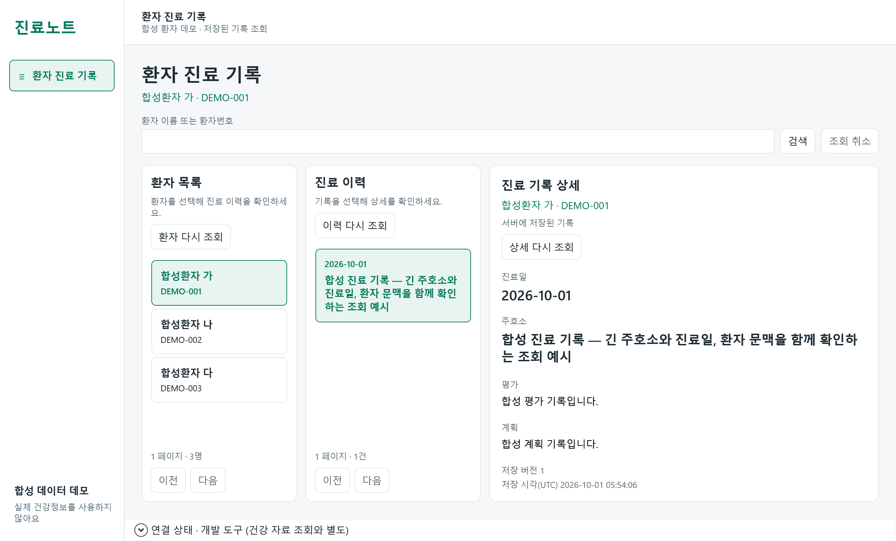
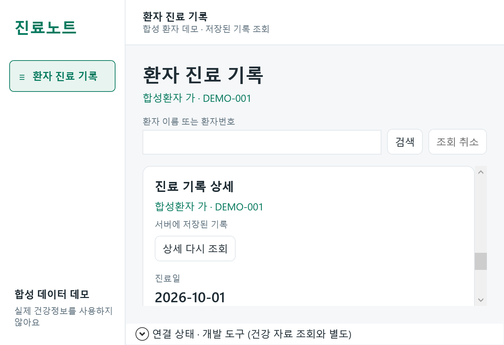

# EMR-102 실제 API 조회 WPF 캡처

2026-10-01 Windows 11 build 26200 / 실제 200% (192 DPI).
실제 loopback Kestrel API에 테스트 소유 임시 DB의 합성 기록을 PUT한 뒤 HttpEmrQuery → VM → 실제 WPF Window로 조회했다.
Source commit: `85cf1798cc474a8ab04473703e9b198e401a76a1`. 이후 commit은 문서/evidence만 변경한다.
PNG는 실제 WPF content render이며 OS desktop screenshot·bitmap DPI simulation·브라우저 시안이 아니다.
각 TXT에 build/DPI/client/outer/work area/HighContrast를 보존했다.

기본 outer 1280×800 / client 1267×764.5 DIP. 최소 outer 720×520 / client 707×484.5 DIP.
작은 화면에서는 세로 reflow와 외부 scroll을 사용한다. 작은 캡처는 상세 panel을 BringIntoView한 상태다.
실제 DPI100/150, mixed-monitor, High Contrast, physical keyboard/screen reader는 미검증이며 후속 검증 기록으로 유지한다.

[조회 계약·검증](../../../docs/emr-102-query-ui.md)

## 환자 · 진료 이력 · 상세

[환경](emr-record.txt)

## 작은 창 상세 영역

[환경](emr-small.txt)

