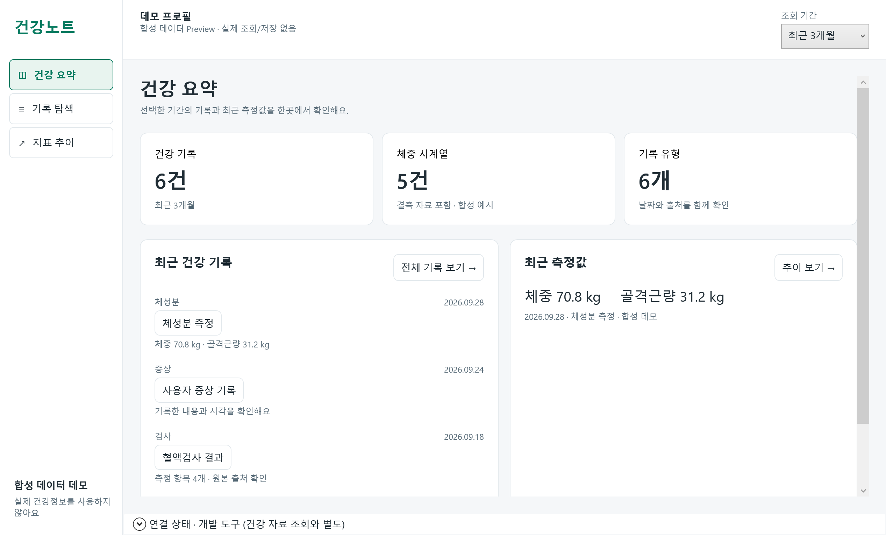
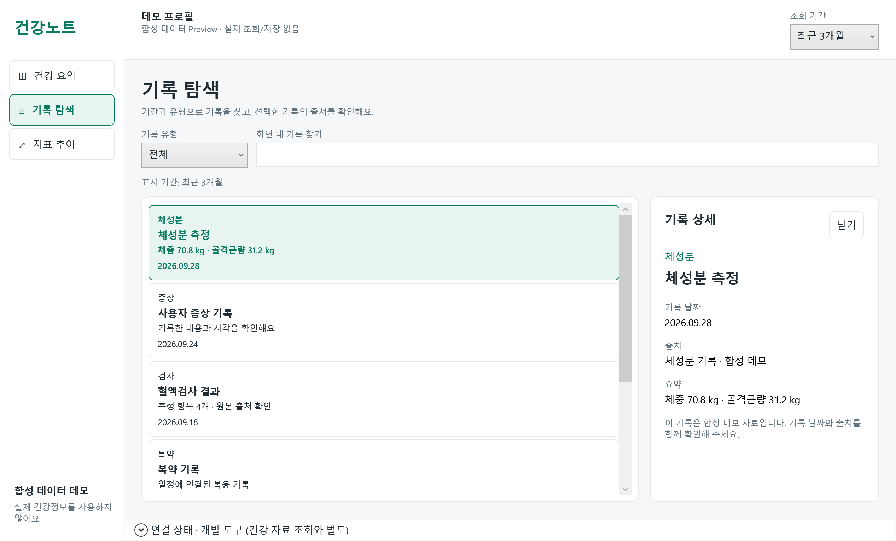
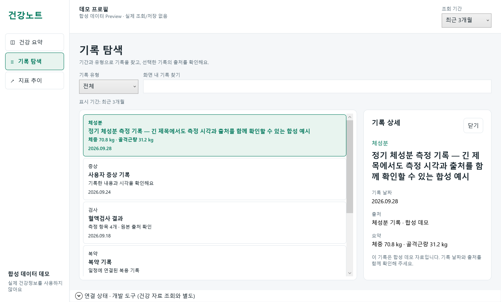
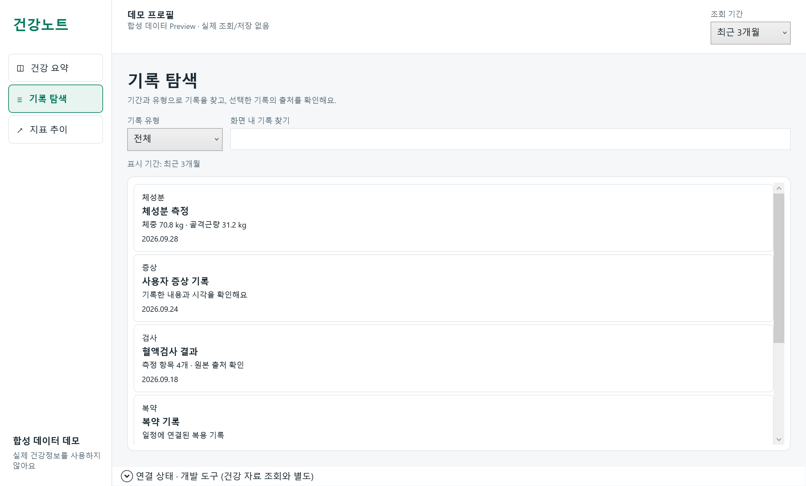
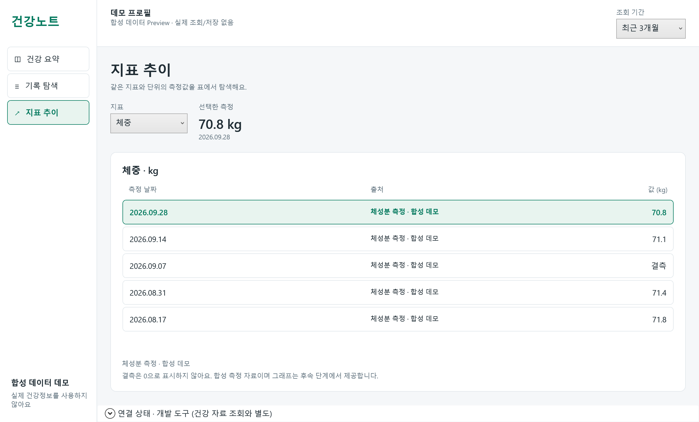
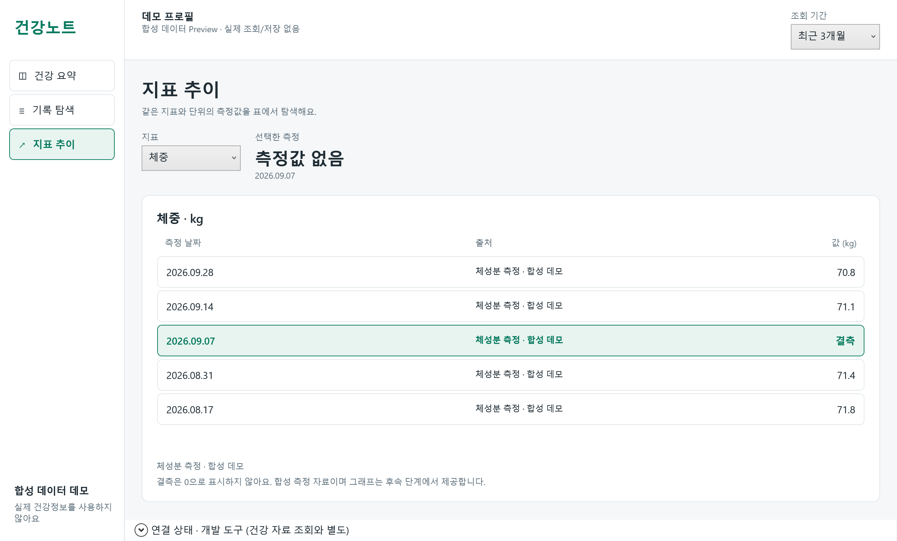
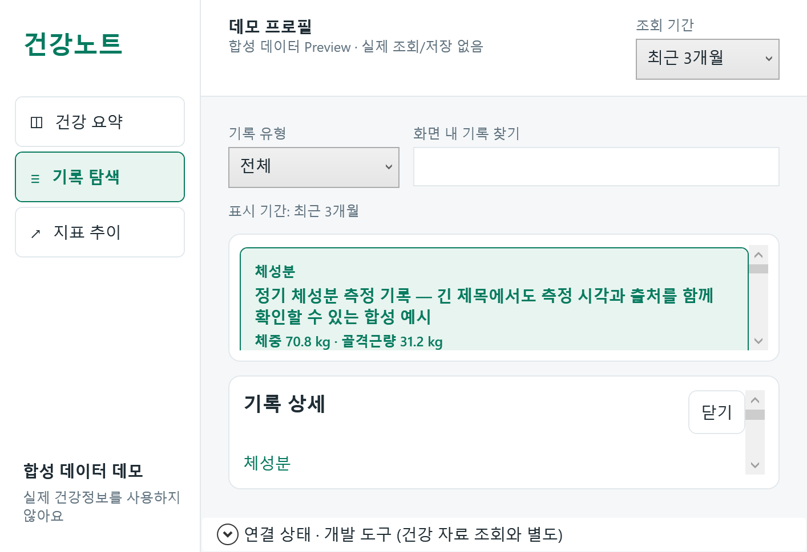

# HC-103 실제 WPF Evidence

2026-10-01. Release source: `71ad371142f9c4c37bf00f9d1dec93551072ce94`.
실제 Windows 11 build 26200 / 200% (192 DPI) 환경에서 표시한 net48 WPF Window의 content를 RenderTargetBitmap으로 캡처했다.
OS desktop/chrome screenshot, 브라우저 시안, bitmap 배율로 만든 DPI 검증 이미지가 아니다.
각 TXT의 build/source version, 실제 Visual DPI, client/outer/screen/work-area 크기를 확인한다.
뒤의 문서/evidence commit은 실행 코드를 변경하지 않는다. CI의 별도 캡처는 artifacts에서 환경을 확인한다.

기본 outer 1280×800 / client 1267×764.5 DIP.
최소 outer 720×520 / client 707×484.5 DIP.
실제 100/150%와 High Contrast, 다중 모니터 이동, 물리 키보드 전체 경로는 미검증이다.
검증 범위·후속 항목은 [WPF foundation 기록](../../../docs/wpf-shell-foundation.md)을 따른다.

| 화면 | 원시 환경 |
| --- | --- |
| Overview | [overview.txt](overview.txt) |
| Timeline 목록·상세 | [timeline-detail.txt](timeline-detail.txt) |
| Timeline 긴 제목 | [timeline-long.txt](timeline-long.txt) |
| Timeline 상세 닫힘 | [timeline-closed.txt](timeline-closed.txt) |
| Trend 표 | [trend.txt](trend.txt) |
| Trend 결측 | [trend-missing.txt](trend-missing.txt) |
| 최소 창 reflow | [timeline-small.txt](timeline-small.txt) |

## Overview

## Timeline 목록·상세

## Timeline 긴 제목

## Timeline 상세 닫힘

## Trend

## Trend 결측

## 최소 창 reflow

